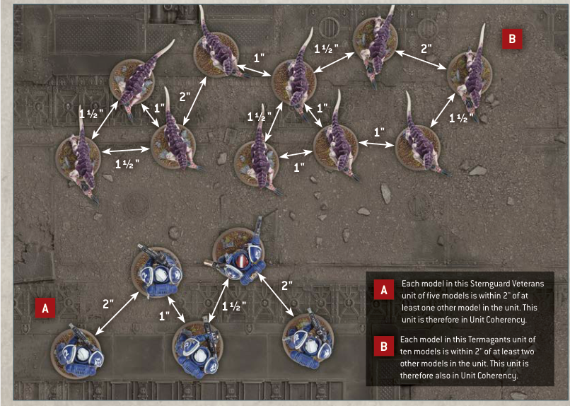

## UNIT COHERENCY

A unit that contains more than one model must be set up and end any kind of move as a single group, with all of its models within 2" horizontally and 5" vertically of at least one other model from that unit. While a unit has seven or more models, all of its models must instead be set up and end any kind of move within 2" horizontally and 5" vertically of at least two other models from that unit. This is called Unit Coherency.

If for any reason a model cannot be set up in Unit Coherency, that model is destroyed. If a unit cannot end a move in Unit Coherency, it cannot make that move and its models are returned to their previous positions.

At the end of every turn, each player must remove models, one at a time, from any of the units from their armies that are no longer in Unit Coherency, until only a single group of models from each of those units remains in play and in Unit Coherency. Models removed in this way count as having been destroyed, but they never trigger any rules that apply when a model is destroyed.

- Unit Coherency: Within 2" horizontally and 5" vertically of:
  - One other model from the same unit (in units of 2-6 models).
  - Two other models from the same unit (in units of 7+ models).
- At the end of every turn, if a unit is not in Unit Coherency, the controlling player must remove models until that unit is in Unit Coherency again.

### Unit Coherency — illustrated examples

**A** Each model in this Sternguard Veterans unit of five models is within 2" of at least one other model in the unit. This unit is therefore in Unit Coherency.

**B** Each model in this Termagants unit of ten models is within 2" of at least two other models in the unit. This unit is therefore also in Unit Coherency.
