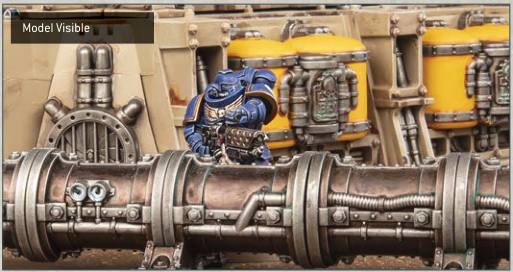
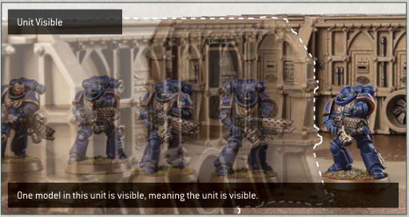
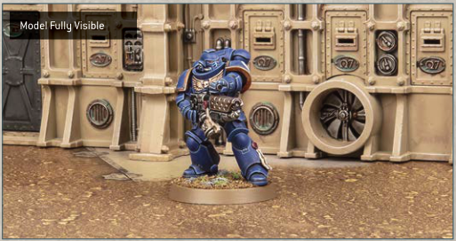
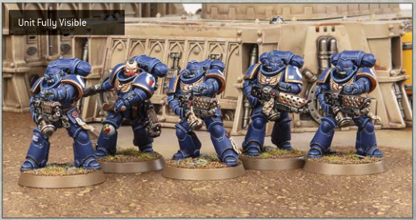

## DETERMINING VISIBILITY

Warhammer 40,000 uses true line of sight to determine visibility between models. To check this, get a 'model's perspective' view by looking from behind the observing model. For the purposes of determining visibility, an observing model can see through other models in its unit, and a model's base is also part of that model.

## MODEL VISIBLE

If any part of another model can be seen from any part of the observing model, that other model is visible to the observing model.

## UNIT VISIBLE

If one or more models in a unit is visible to the observing model, then that model's unit is visible to the observing model.

One model in this unit is visible, meaning the unit is visible.

## MODEL FULLY VISIBLE

If every part of another model that is facing the observing model can be seen from any part of the observing model, then that other model is said to be fully visible to the observing model, i.e. the observing model has line of sight to all parts of the other model that are facing it, without any other models or terrain features blocking visibility to any of those parts.

## UNIT FULLY VISIBLE

If every model in a unit is fully visible to an observing model, then that unit is fully visible to that observing model. For the purposes of determining if an enemy unit is fully visible, an observing model can see through other models in the unit it is observing.

- Model Visible: If any part of a model can be seen, it is visible.
- Unit Visible: If any model in a unit is visible, that model's unit is visible.
- Model Fully Visible: If every facing part of a model can be seen, it is fully visible.
- Unit Fully Visible: If every model in a unit is fully visible, that unit is fully visible.
