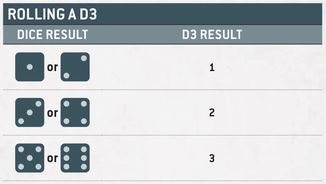

<!-- image -->

9

## Hints and Tips DICE ROLLING

In a game of Warhammer 40,000 you and your opponent will be rolling, and in some cases re-rolling, lots of dice. It is good practice to always make sure your opponent knows what you are rolling dice for, and what abilities and rules are in effect that enable you to make any re-rolls.

Many gamers roll their dice somewhere on the battlefield, but some roll their dice elsewhere, such as in a dice tray. Wherever you roll your dice, make sure you roll the dice where your opponent can see the results too. If a dice is rolled out of bounds (i.e. it rolls off your battlefield, out of your dice tray or ends up on the floor), it is very common to ignore the result of that dice and roll it again. Rolling an out-of-bounds dice again doesn't count as having re-rolled that dice.

If a dice does not lie flat on your battlefield after it has been thrown, it is called a cocked dice. Some players use a house rule that unless a dice is flat after it has been rolled, or unless you can balance another dice on top of a cocked dice without it sliding off, it must be rolled again. It is more common for players to roll the dice again only if they can't be sure of the result. In any case, rolling a cocked dice again doesn't count as having re-rolled that dice.

## DICE

In order to fight a battle, you will require some six-sided dice (often abbreviated to D6). Some rules refer to 2D6, 3D6 and so on - in such cases, roll that many D6 and add the results together.

If a rule requires you to roll a D3, roll a D6 and halve the result (rounding up to a whole number) to get the D3 result, as shown below.

### ROLLING A D3

| D6 result | D3 result |
|---|---|
| 1 or 2 | 1 |
| 3 or 4 | 2 |
| 5 or 6 | 3 |

If a rule requires a dice roll of, for example, 3 or more, this is often abbreviated to 3+. Where several consecutive dice results are relevant to a rule, these are often shown as a range (e.g. 1-3).

## RE-ROLLS

Some rules allow you to re-roll a dice roll, which means you get to roll some or all of the dice again. If a rule allows you to re-roll a dice roll that was made by adding several dice together (e.g. 2D6, 3D6, etc.) then, unless otherwise stated, you must re-roll all of those dice again.

You can never re-roll a dice more than once, and re-rolls happen before modifiers (if any) are applied. Rules that refer to the value of an 'unmodified' dice roll are referring to the dice result after any re-rolls, but before any modifiers are applied.

- ■ Unmodified Dice: the result after re-rolls, but before any modifiers.
- ■ You must re-roll all dice if several need adding together (e.g. 2D6).
- ■A dice can never be re-rolled more than once.
- ■Re-rolls are applied before any modifiers.

<!-- image -->

## ROLL-OFFS

Some rules instruct players to roll off. To do so, both players roll one D6, and whoever scores highest wins the roll-off. If there is a tie for the highest roll, roll off again. Neither player is allowed to re-roll or modify any of the D6 when making a roll-off.

## SEQUENCING

While playing Warhammer 40,000, you'll occasionally find that two or more rules are to be resolved at the same time. If this occurs during the battle, the player whose turn it is chooses the order. If this occurs before or after the battle, or at the start or end of a battle round, the players roll off and the winner decides the order in which those rules are resolved.