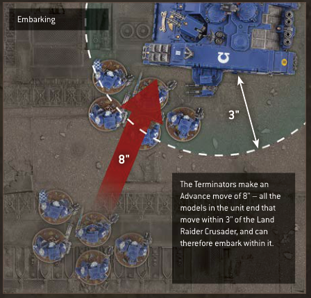
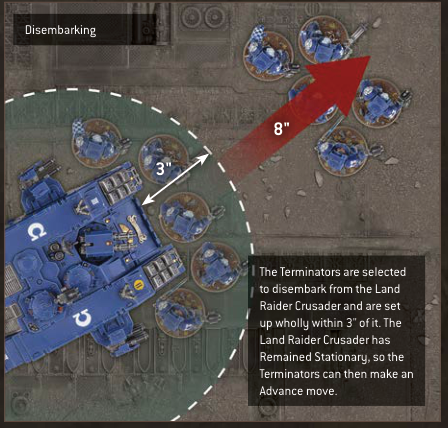
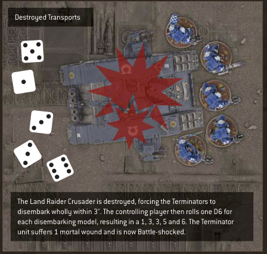

## DESTROYED TRANSPORTS

If a Transport model is destroyed, any units embarked within that Transport model must immediately disembark (see opposite) before that Transport model is removed from the battlefield.

Units that disembark from a destroyed Transport model are not affected by that model's Deadly Demise ability (pg 23). Instead, you must roll one D6 for each disembarking model. For each roll of 1, that disembarking model's unit suffers 1 mortal wound (pg 23). In addition, if a unit disembarks from a destroyed Transport model:

- Until the start of its controlling player's next Command phase, that unit is Battle-shocked.

- Until the end of the turn, that unit counts as having made a Normal move this turn, and cannot declare a charge this turn (pg 29).

- If a Transport is destroyed, any embarked units must disembark.

- Roll one D6 for each model that disembarks: for each 1, that model's unit suffers 1 mortal wound.

- Until the start of its controlling player's next Command phase, the disembarking unit is Battle-shocked.

- Until the end of the turn, the disembarking unit counts as having made a Normal move, and cannot declare a charge.

## Emergency Disembarkation

If a Transport model is destroyed and it is not possible to set up a disembarking unit wholly within 3" of that Transport model and not within Engagement Range of any enemy models, that unit must instead perform an Emergency Disembarkation. This is performed as described for disembarking from a destroyed Transport model, except that a unit that does so must be set up wholly within 6" of the destroyed Transport model (instead of wholly within 3") and not within Engagement Range of any enemy models, and when rolling for each disembarking model, that unit suffers 1 mortal wound for each roll of 1-3 (instead of for each roll of 1). If, for any reason, a disembarking model still cannot be set up, that model is destroyed.

- Units disembarking a destroyed Transport that cannot be set up wholly within 3" of it must perform an Emergency Disembarkation:

- Must be set up wholly within 6" of it instead of wholly within 3".

- Suffer 1 mortal wound for each roll of 1-3, instead of each roll of 1.

- Any disembarking model that cannot be set up is destroyed.

## TRANSPORT EXAMPLES

### Embarking — illustrated example

The Terminators make an Advance move of 8" - all the models in the unit end that move within 3" of the Land Raider Crusader, and can therefore embark within it.

### Disembarking — illustrated example

The Terminators are selected to disembark from the Land Raider Crusader and are set up wholly within 3" of it. The Land Raider Crusader has Remained Stationary, so the Terminators can then make an Advance move.

### Destroyed Transports — illustrated example

The Land Raider Crusader is destroyed, forcing the Terminators to disembark wholly within 3". The controlling player then rolls one D6 for each disembarking model, resulting in a 1, 3, 3, 5 and 6. The Terminator unit suffers 1 mortal wound and is now Battle-shocked.
