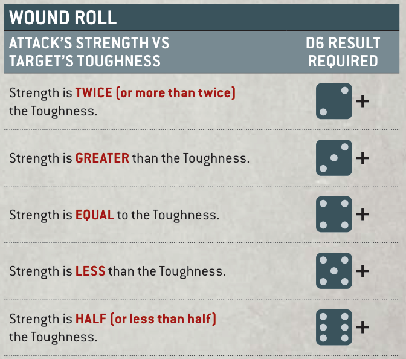

# MAKING ATTACKS

Attacks are made using ranged or melee weapons. Attacks can be made one at a time or, in some cases, you can roll for multiple attacks together (see Fast Dice Rolling, page 24).

Use the following sequence to make attacks one at a time.

1. HIT ROLL

2. WOUND ROLL

3. ALLOCATE ATTACK

4. SAVING THROW

5. INFLICT DAMAGE

## 1. HIT ROLL

When a model makes an attack, make one Hit roll for that attack by rolling one D6. If the result of the Hit roll is greater than or equal to the attack's Ballistic Skill (BS) characteristic (if the attack is being made with a ranged weapon) or its Weapon Skill (WS) characteristic (if the attack is being made with a melee weapon), then that Hit roll is successful and scores one hit against the target unit. Otherwise, the attack fails and the attack sequence ends.

An unmodified Hit roll of 6 is called a Critical Hit and is always successful. An unmodified Hit roll of 1 always fails. A Hit roll can never be modified by more than -1 or +1.

- Hit Roll (Ranged Attack): A hit is scored if the D6 result equals or exceeds that attack's BS.

- Hit Roll (Melee Attack): A hit is scored if the D6 result equals or exceeds that attack's WS.

- Critical Hit: Unmodified Hit roll of 6. Always successful. ■An unmodified Hit roll of 1 always fails.

- A Hit roll can never be modified by more than -1 or +1.

## 2. WOUND ROLL

Each time an attack scores a hit against a target unit, make a Wound roll for that attack by rolling one D6 to see if that attack successfully wounds the target unit. The result required is determined by comparing the attack's Strength (S) characteristic with the target's Toughness (T) characteristic, as shown below.

### WOUND ROLL

| Attack’s Strength vs target’s Toughness | D6 result required |
|---|---|
| Strength is TWICE (or more than twice) the Toughness. | 2+ |
| Strength is GREATER than the Toughness. | 3+ |
| Strength is EQUAL to the Toughness. | 4+ |
| Strength is LESS than the Toughness. | 5+ |
| Strength is HALF (or less than half) the Toughness. | 6+ |
