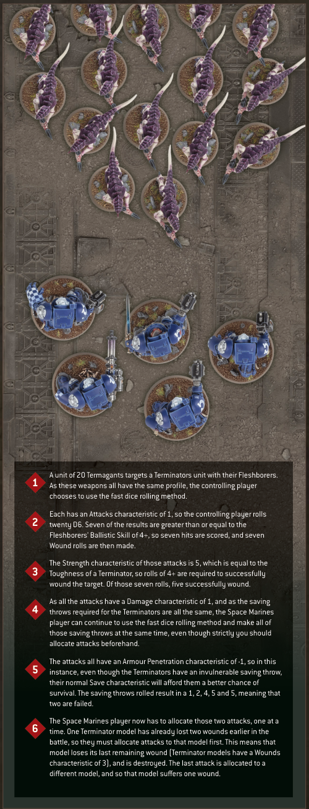

# Hints and Tips FAST DICE ROLLING

The rules for making attacks have been written assuming you will resolve them one at a time. However, it is possible to speed up your battles by rolling the dice for similar attacks together. In order to make several attacks at once, all of the attacks must have the same Ballistic Skill (if it's a ranged attack) or the same Weapon Skill (if it's a melee attack). They must also have the same Strength and Armour Penetration characteristics, they must inflict the same Damage, they must be affected by the same abilities, and they must be directed at the same unit. If this is the case, make all of the Hit rolls at the same time, then all of the Wound rolls. Your opponent can then allocate the attacks one at a time, making the saving throws and suffering damage each time as appropriate.

Note that if all the models in the target unit would require the same saving throw against the attacks, and the order in which the attacks are allocated would make no difference, then your opponent can make all their saving throws at the same time, and can do so as soon as the Wound rolls have been made. If they do, they then allocate the attacks that resulted in failed saving throws one at a time, inflicting the damage as appropriate even though, strictly speaking, saving throws should be made after attacks have been allocated. In any case, remember that if the target unit contains a model that has already lost any wounds or has already had attacks allocated to it this phase, the controlling player must allocate further attacks to that model until either it is destroyed, or all the attacks have been saved or resolved.

If the attacks being allocated to a target inflict random damage, you cannot use the fast dice rolling approach exactly as stated above - you will need to roll the dice one at a time. Consider several attacks with a Damage characteristic of D3 being allocated to a target containing models with two wounds each. As excess damage is lost each time a model is destroyed, the order in which the attacks are allocated and resolved becomes important. If the results of those D3s were 1, then 2, then 3, the attacks would result in a total of two destroyed models, but applying them in the order 3, then 2, then 1 would result in two models being destroyed and a third being damaged with only one wound remaining. As such, the rolls should be made one at a time.

1 A unit of 20 Termagants targets a Terminators unit with their Fleshborers. As these weapons all have the same profile, the controlling player chooses to use the fast dice rolling method.

2 Each has an Attacks characteristic of 1, so the controlling player rolls twenty D6. Seven of the results are greater than or equal to the Fleshborers' Ballistic Skill of 4+, so seven hits are scored, and seven Wound rolls are then made.

3 The Strength characteristic of those attacks is 5, which is equal to the Toughness of a Terminator, so rolls of 4+ are required to successfully wound the target. Of those seven rolls, five successfully wound.

4 As all the attacks have a Damage characteristic of 1, and as the saving throws required for the Terminators are all the same, the Space Marines player can continue to use the fast dice rolling method and make all of those saving throws at the same time, even though strictly you should allocate attacks beforehand.

5 The attacks all have an Armour Penetration characteristic of -1, so in this instance, even though the Terminators have an invulnerable saving throw, their normal Save characteristic will afford them a better chance of survival. The saving throws rolled result in a 1, 2, 4, 5 and 5, meaning that two are failed.

6 The Space Marines player now has to allocate those two attacks, one at a time. One Terminator model has already lost two wounds earlier in the battle, so they must allocate attacks to that model first. This means that model loses its last remaining wound (Terminator models have a Wounds characteristic of 3), and is destroyed. The last attack is allocated to a different model, and so that model suffers one wound.
