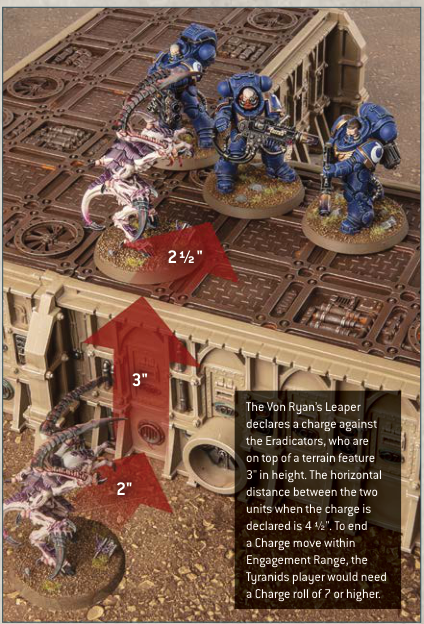
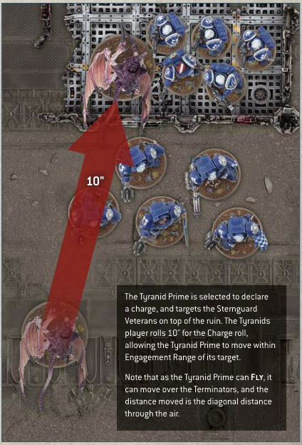

# CHARGING OVER TERRAIN

Unless otherwise stated, a model can be moved over a terrain feature when it makes a Charge move, but not through it.

A model can be moved over terrain features that are 2" or less in height as if they were not there. A model can be moved vertically in order to climb up, down and over any terrain features that are taller than this, counting the vertical distance up and/or down as part of its Charge move. Models cannot end a Charge move mid-climb - if it is not possible to make a Charge move as a result, the charge fails.

- Models can be moved freely over terrain features 2" or less in height.

- Models cannot move through terrain features taller than 2", but can climb up and down them.

The Von Ryan's Leaper declares a charge against the Eradicators, who are on top of a terrain feature 3" in height. The horizontal distance between the two units when the charge is declared is 4 1/2". To end a Charge move within Engagement Range, the Tyranids player would need a Charge roll of 7 or higher.

# CHARGING WITH FLYING MODELS

When a model that can Fly starts or ends a Charge move on a terrain feature, instead of measuring the path it has moved across the battlefield, you instead measure its path 'through the air'. In addition, it can be moved over other models as if they were not there. A model that can Fly cannot end any move on top of another model.

- Fly models can move over other models when they make a Charge move.

- Fly models that start or end a Charge move on a terrain feature measure distance moved through the air when they make a Charge move.

The Tyranid Prime is selected to declare a charge, and targets the Sternguard Veterans on top of the ruin. The Tyranids player rolls 10" for the Charge roll, allowing the Tyranid Prime to move within Engagement Range of its target. Note that as the Tyranid Prime can Fly, it can move over the Terminators, and the distance moved is the diagonal distance through the air.
