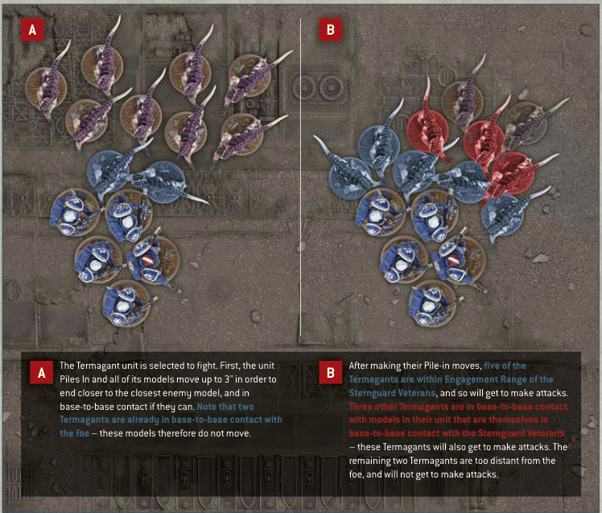
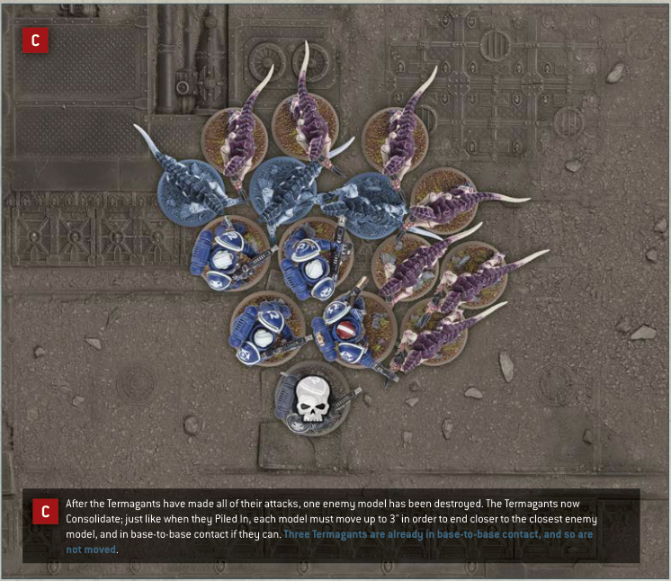

# FIGHT — illustrated example

A The Termagant unit is selected to fight. First, the unit Piles In and all of its models move up to 3" in order to end closer to the closest enemy model, and in base-to-base contact if they can. Note that two Termagants are already in base-to-base contact with the foe - these models therefore do not move.

B After making their Pile-in moves, five of the Termagants are within Engagement Range of the Sternguard Veterans, and so will get to make attacks. Three other Termagants are in base-to-base contact with models in their unit that are themselves in base-to-base contact with the Sternguard Veterans - these Termagants will also get to make attacks. The remaining two Termagants are too distant from the foe, and will not get to make attacks.

C After the Termagants have made all of their attacks, one enemy model has been destroyed. The Termagants now Consolidate; just like when they Piled In, each model must move up to 3" in order to end closer to the closest enemy model, and in base-to-base contact if they can. Three Termagants are already in base-to-base contact, and so are not moved.
