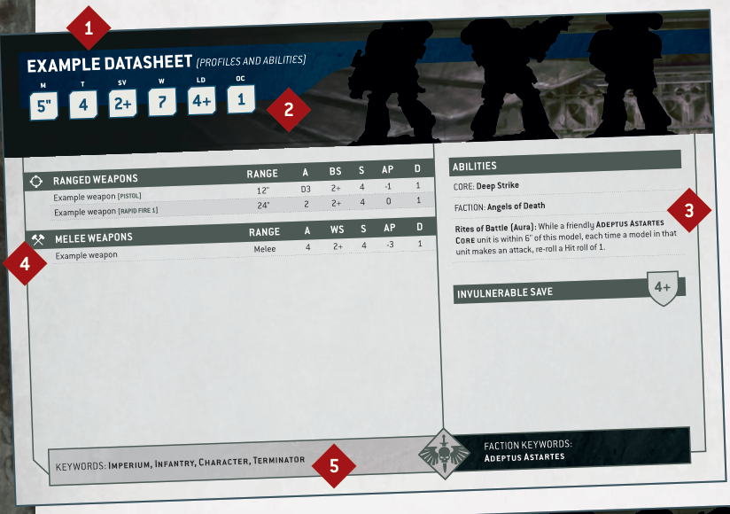
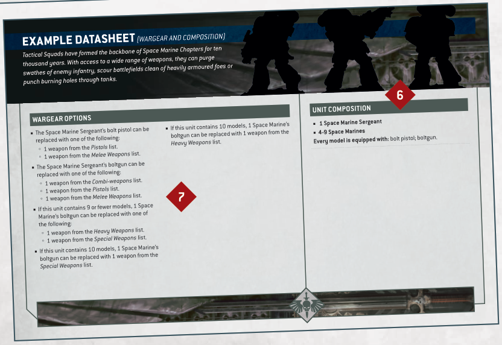

# DATASHEETS

Each unit has a datasheet that lists the characteristics, wargear, abilities and keywords of its models. This section presents a summary of these elements and how they relate to playing the game.

## EXAMPLE DATASHEET (PROFILES AND ABILITIES)

## EXAMPLE DATASHEET (WARGEAR AND COMPOSITION)

