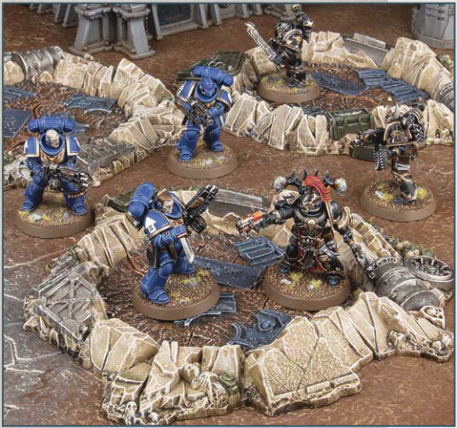
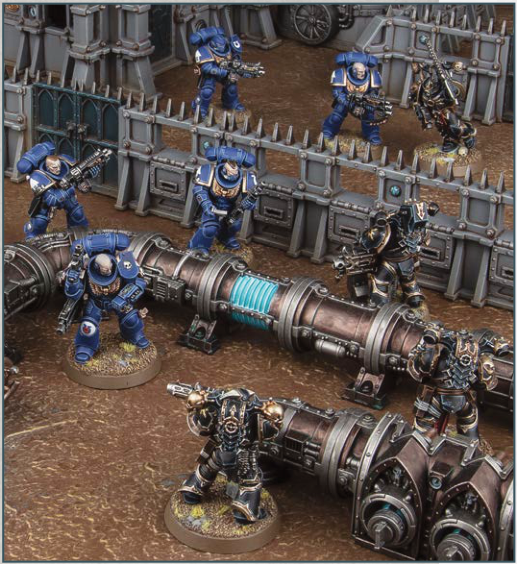

# CRATERS AND RUBBLE

Many battlefields bear the scars of heavy and sustained bombardment.

## MOVEMENT

Models can be moved over this terrain feature, as described on page 15.

## VISIBILITY

Normal visibility rules apply.

## BENEFIT OF COVER

Each time a ranged attack is allocated to an Infantry model that is wholly on top of this terrain feature, that model has the Benefit of Cover against that attack.

KEYWORDS: Area Terrain, Crater

# BARRICADES AND FUEL PIPES

Fuel pipes and purpose-made defence lines are excellent positions from which to repel the enemy.

## MOVEMENT

Models can move up, over and down this terrain feature, but they cannot be set up or end any kind of move on top of it.

## VISIBILITY

Normal visibility rules apply.

## ENGAGEMENT RANGE

- In the Charge phase, if an enemy unit is within 1" of this terrain feature, a charging unit on the opposite side of this terrain feature can still make a Charge move against that enemy unit provided it ends that Charge move as close as possible to this terrain feature and within 2" of that enemy unit.

- In the Fight phase, units are eligible to fight - and models can make attacks - if their target is on the opposite side of this terrain feature and within 2" of them.

## BENEFIT OF COVER

Each time a ranged attack is allocated to an Infantry model that is wholly within 3" of this terrain feature, if that model is not fully visible to every model in the attacking unit because of this terrain feature, that model has the Benefit of Cover against that attack.

KEYWORDS: Obstacle, Barricade
