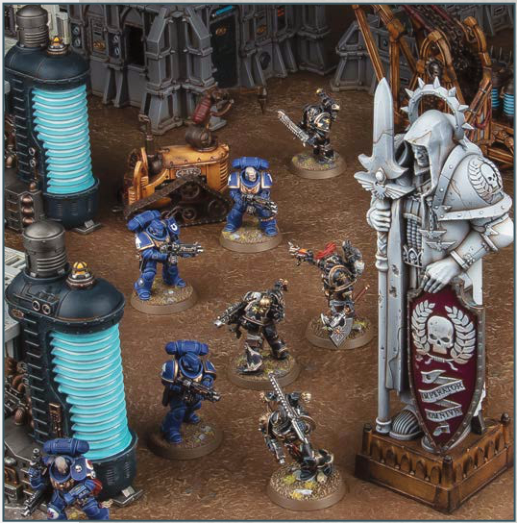
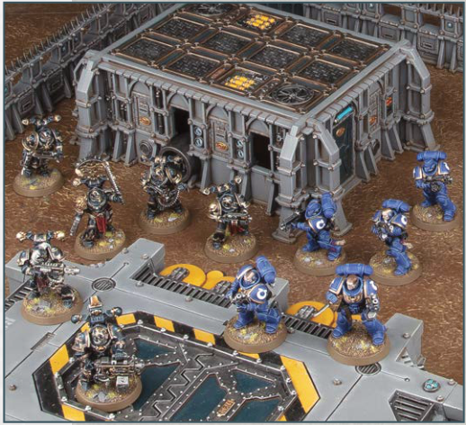

# BATTLEFIELD DEBRIS AND STATUARY

Discarded industrial machinery, power reactors, ancient statuary and other detritus of war litter the battlefields of the 41st Millennium.

## MOVEMENT

Models can move up, over and down this terrain feature, but they cannot be set up or end any kind of move on top of it.

## VISIBILITY

Normal visibility rules apply.

## BENEFIT OF COVER

Each time a ranged attack is allocated to a model, if that model is not fully visible to every model in the attacking unit because of this terrain feature, that model has the Benefit of Cover against that attack.

KEYWORDS: Obstacle, Battlefield Debris

# HILLS, INDUSTRIAL STRUCTURES, SEALED BUILDINGS AND ARMOURED CONTAINERS

A sealed bunker, Mechanicus gantry-way, armoured container or even a simple hill can shelter troops from the enemy's sight and provide a superior vantage point to those atop it.

## MOVEMENT

These terrain features are raised areas that models can be set up on top of or end a move on top of, provided the model's base does not overhang the terrain feature (if the model does not have a base, no part of that model that would be in contact with the battlefield at ground level can overhang that terrain feature). In addition, other terrain features can be set up on top of a Hill terrain feature, provided no part of those terrain features overhangs that Hill terrain feature.

## VISIBILITY

Normal visibility rules apply.

## BENEFIT OF COVER

Each time a ranged attack is allocated to a model, if that model is not fully visible to every model in the attacking unit because of this terrain feature, that model has the Benefit of Cover against that attack.

KEYWORDS: Hill
