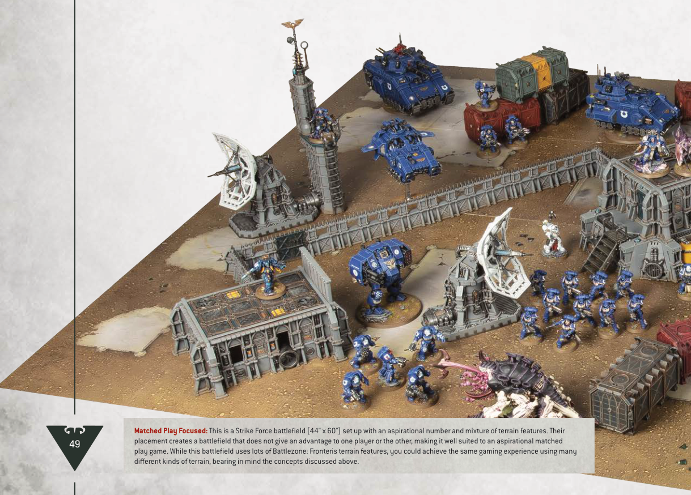

# EXAMPLE BATTLEFIELDS

In the far future, battles are fought across an infinite variety of strange and alien planets where no land is left untouched by the tempest of war. Crystal moons, derelict space hulks, carnivorous death worlds and war-ravaged cityscapes are just a few of the fantastical landscapes that can be recreated.

Battlefields are typically created by placing Battlezones next to each other. Battlezones are Citadel terrain sets that include two boards (each approximately 22" by 30" in size) and a range of terrain features designed to be set up evenly on those boards for the best Warhammer 40,000 gaming experience. Don't worry if your battlefield doesn't match these requirements, but keep in mind that playing on a battlefield that is either a barren wasteland or filled to overflowing with terrain features may give an advantage to one side or the other.

Below is an example of a battlefield set up for a Strike Force battle, with a good mixture of different terrain features fairly distributed across the battlefield. Their placement will create a dynamic gaming experience that doesn't favour one player over the other.

Importantly, some terrain features that block visibility have been placed near the middle of the battlefield, ensuring that it is not easy to see from one side of the battlefield to the other. Battlefields where this is not the case can advantage armies that rely on shooting, or disadvantage armies that rely on melee. There is also sufficient room for larger models such as vehicles to manoeuvre around the terrain features, especially near the edges, without getting trapped.

Matched Play Focused: This is a Strike Force battlefield (44" x 60") set up with an aspirational number and mixture of terrain features. Their placement creates a battlefield that does not give an advantage to one player or the other, making it well suited to an aspirational matched play game. While this battlefield uses lots of Battlezone: Fronteris terrain features, you could achieve the same gaming experience using many different kinds of terrain, bearing in mind the concepts discussed above.
