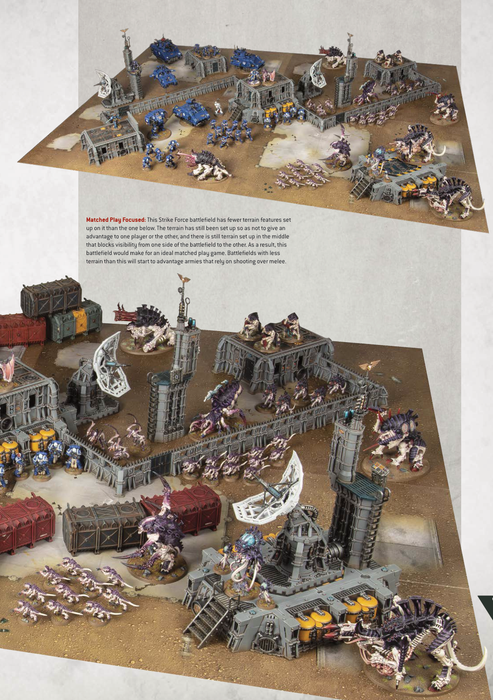

# EXAMPLE BATTLEFIELDS (continued)

Matched Play Focused: This Strike Force battlefield has fewer terrain features set up on it than the one below. The terrain has still been set up so as not to give an advantage to one player or the other, and there is still terrain set up in the middle that blocks visibility from one side of the battlefield to the other. As a result, this battlefield would make for an ideal matched play game. Battlefields with less terrain than this will start to advantage armies that rely on shooting over melee.
