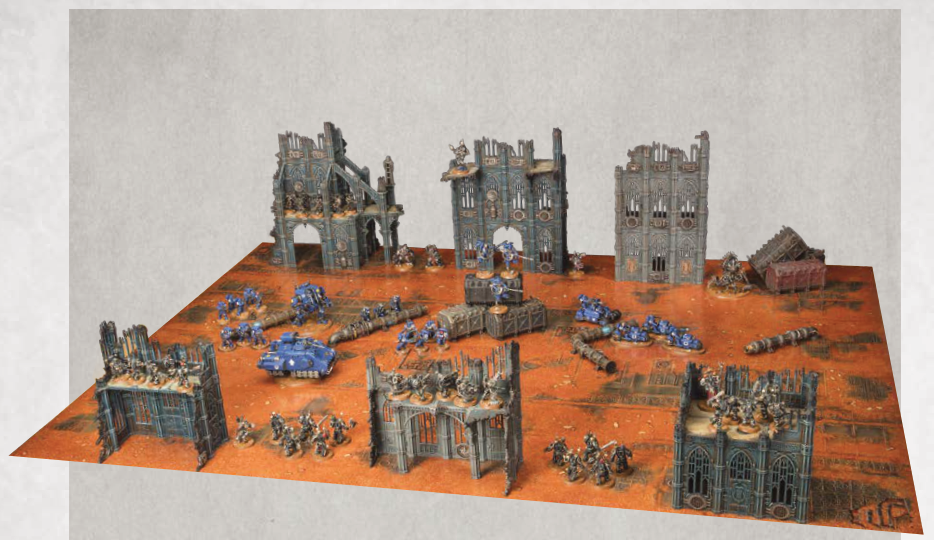
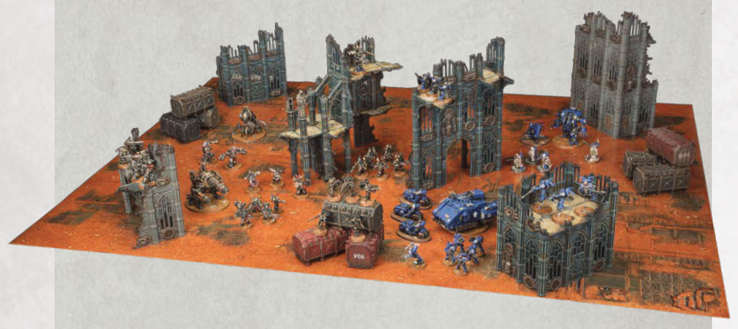

# EXAMPLE BATTLEFIELDS (continued)

Narrative Play Focused: This Strike Force battlefield has an ideal number and mixture of terrain features. The largest pieces of Area Terrain have been set up along the two long battlefield edges, while the middle of the battlefield only has a scattering of Obstacles to provide any kind of shelter from enemy fire. While this battlefield is not ideal for a matched play game, it would make for a very thematic set-up for a narrative play game.

Matched Play Focused: This Strike Force battlefield is very similar to the one above in terms of number and types of terrain features, but they have been set up more evenly across the battlefield, and the middle contains terrain features that block visibility from one side of the battlefield to the other. This battlefield doesn't give an advantage to one player or the other, and is far more suited to a typical matched play game.
