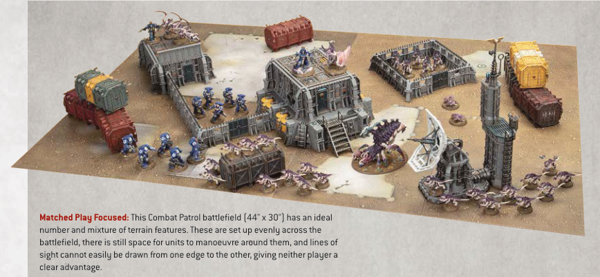
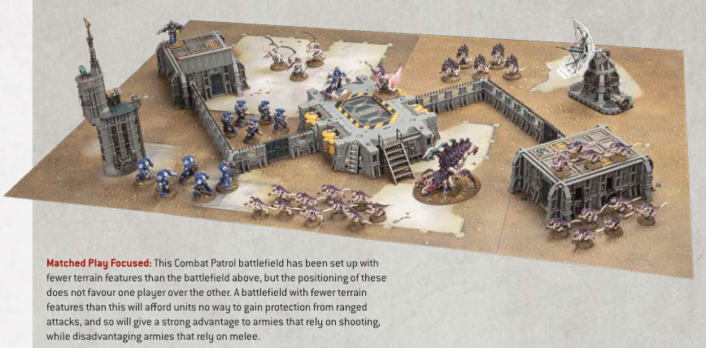
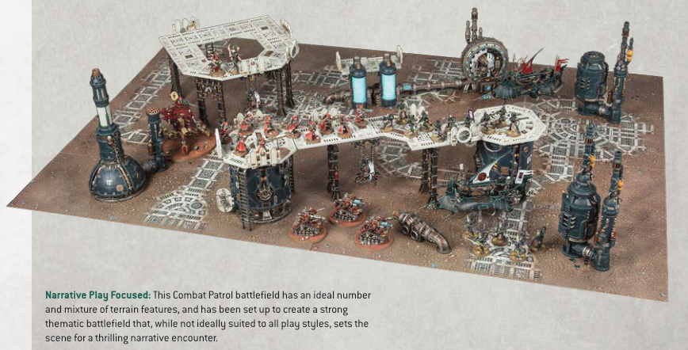

# COMBAT PATROL SET-UPS

Matched Play Focused: This Combat Patrol battlefield (44" x 30") has an ideal number and mixture of terrain features. These are set up evenly across the battlefield, there is still space for units to manoeuvre around them, and lines of sight cannot easily be drawn from one edge to the other, giving neither player a clear advantage.

Matched Play Focused: This Combat Patrol battlefield has been set up with fewer terrain features than the battlefield above, but the positioning of these does not favour one player over the other. A battlefield with fewer terrain features than this will afford units no way to gain protection from ranged attacks, and so will give a strong advantage to armies that rely on shooting, while disadvantaging armies that rely on melee.

Narrative Play Focused: This Combat Patrol battlefield has an ideal number and mixture of terrain features, and has been set up to create a strong thematic battlefield that, while not ideally suited to all play styles, sets the scene for a thrilling narrative encounter.
