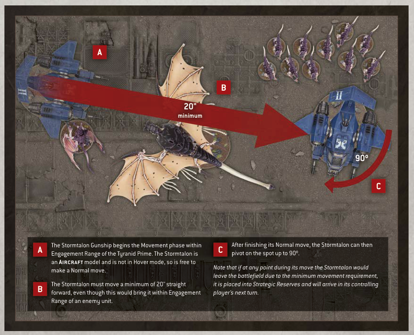

# AIRCRAFT (continued)

## AIRCRAFT AND THE MOVEMENT OF OTHER MODELS

When a unit is selected to move in the Movement phase, if the only enemy models that are within Engagement Range of that unit are Aircraft models, then that unit can still make a Normal or Advance move.

Whenever a model makes any kind of move, it can be moved over enemy Aircraft models as if they were not there, and can be moved within Engagement Range of enemy Aircraft models, but it cannot end that move on top of another model or within Engagement Range of any enemy Aircraft models.

- Units can still make a Normal or Advance move if they are only within Engagement Range of enemy Aircraft.

- Models can move within Engagement Range of enemy Aircraft, but cannot end a move within Engagement Range of enemy Aircraft.

- Models can move over Aircraft when they make any kind of move.

## AIRCRAFT IN THE CHARGE AND FIGHT PHASES

Aircraft units cannot declare a charge, and only units that can Fly can select an Aircraft unit as a target of their charge. Such units can end their Charge move within Engagement Range of one or more enemy Aircraft units.

An Aircraft model is only eligible to fight if it is within Engagement Range of one or more enemy units that can Fly, and it can only make melee attacks against units that can Fly. Only models that can Fly can make melee attacks against Aircraft units.

Aircraft models cannot make Pile-in or Consolidation moves. Each time a model makes a Pile-in or Consolidation move, unless that model can Fly, Aircraft models are ignored for the purposes of moving closer to the closest enemy model.

- Only units that can Fly can charge at or make melee attacks against Aircraft.

- Aircraft cannot charge, Pile In or Consolidate, and can only make melee attacks against units that can Fly.

- When a model Piles In or Consolidates, unless it can Fly, ignore Aircraft when determining the closest enemy model.

A The Stormtalon Gunship begins the Movement phase within Engagement Range of the Tyranid Prime. The Stormtalon is an Aircraft model and is not in Hover mode, so is free to make a Normal move.

B The Stormtalon must move a minimum of 20" straight forward, even though this would bring it within Engagement Range of an enemy unit.

C After finishing its Normal move, the Stormtalon can then pivot on the spot up to 90º.

Note that if at any point during its move the Stormtalon would leave the battlefield due to the minimum movement requirement, it is placed into Strategic Reserves and will arrive in its controlling player's next turn.
