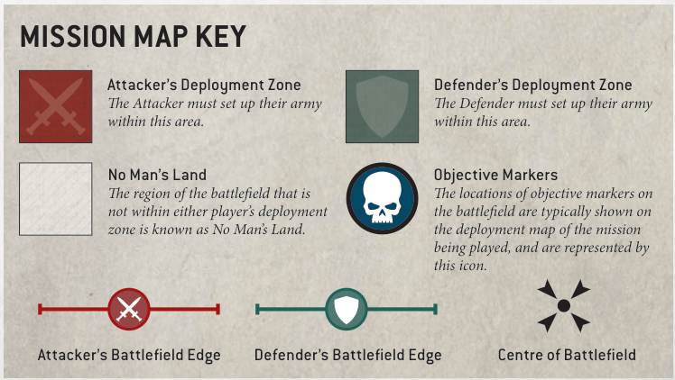

# OBJECTIVE MARKERS

Objective markers represent objects of tactical or strategic import that both sides are attempting to secure, such as valuable artefacts, vital supplies or communications nodes. If a mission uses objective markers, it will state where they are located on the battlefield. These can be represented using any suitable marker, but we recommend using round markers that are 40mm in diameter.

When setting objective markers up on the battlefield, place them so they are centred on the point specified by the mission. When measuring distances to and from objective markers, measure to and from the closest part of them. Models can move over objective markers as if they were not there, but they cannot end a move on top of an objective marker.

At the start of the battle, each objective marker on the battlefield is said to be contested, and so is not controlled by either player. To control an objective marker, a player will first need to move models within range of it. A model is within range of an objective marker if it is within 3" horizontally and 5" vertically of that objective marker.

Every model has an Objective Control (OC) characteristic listed on its datasheet. To determine a player's Level of Control over an objective marker, add together the OC characteristics of all the models from that player's army that are within range of that objective marker. A player will control an objective marker at the end of any phase if their Level of Control over it is greater than their opponent's. If both players have the same Level of Control over an objective marker, that objective marker is contested.

- A model is within range of an objective marker if within 3" horizontally and 5" vertically.

- Level of Control: Add together the OC characteristics of all of a player's models within range of the objective marker.

- An objective marker is controlled by the player with the highest Level of Control over it (in a tie, it is contested).

- Models cannot end a move on top of an objective marker.

## Hints and Tips OBJECTIVE MARKERS AND TERRAIN FEATURES

Many players choose to bring the narrative of their missions to life by positioning objective markers within exciting terrain features on the battlefield. When setting up terrain features, you can place them where an objective marker would be, so long as you can reposition that objective marker directly on top of that terrain feature and it lies flat, without overhanging any part of it. That objective marker should still be more than 1" away from all impassable parts of that terrain feature (such as the walls of a ruin) so that there is sufficient room for models to move around it.

If it is not possible to set up terrain features or objective markers in this way, and both players agree, you can nudge the positions of any terrain feature or objective marker so that these conditions are satisfied. Of course, the final position of an objective marker should still be as close as possible to the location indicated on your mission's deployment map, but if both players are happy to tweak the battlefield arrangement to forge a stronger narrative, you should feel free to do so.

## MISSION MAP KEY

Attacker's Deployment Zone The Attacker must set up their army within this area.

Defender's Deployment Zone The Defender must set up their army within this area.

No Man's Land The region of the battlefield that is not within either player's deployment zone is known as No Man's Land.

Objective Markers The locations of objective markers on the battlefield are typically shown on the deployment map of the mission being played, and are represented by this icon.

Attacker's Battlefield Edge Defender's Battlefield Edge Centre of Battlefield
