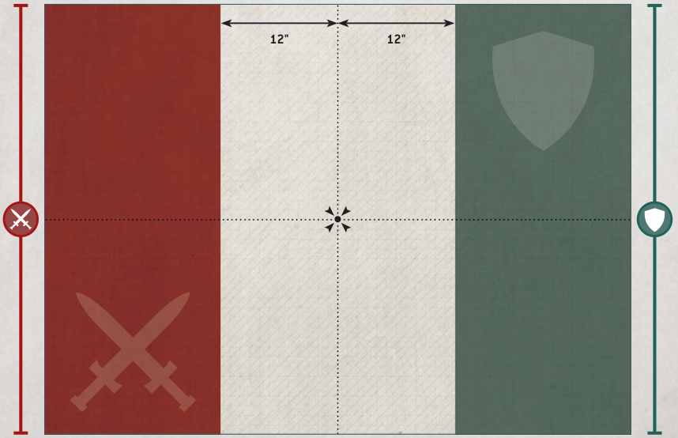

# ONLY WAR (continued)

## 6. DEPLOY ARMIES

Players then alternate deploying their units, one at a time, starting with the Attacker. Models must be set up wholly within their controlling player's deployment zone. Continue setting up units until both players have set up all the units from their armies, or you have run out of room to set up more units. If one player has finished setting up their army, their opponent continues to set up the remaining units from their army.

If both players have units with abilities that allow them to be set up after both armies have deployed, the players must roll off after all other units have been set up and alternate setting up those units, starting with the winner.

## 7. DETERMINE FIRST TURN

Players should roll off again, and the winner takes the first turn.

## 8. RESOLVE PRE-BATTLE RULES

Players now resolve any pre-battle rules their armies have.

## 9. BEGIN THE BATTLE

The first battle round begins. Players continue to resolve battle rounds until the battle ends.

## 10. END THE BATTLE

The battle ends when all of the models in one player's army have been destroyed, or once the fifth battle round has ended (whichever comes first).

## 11. DETERMINE VICTOR

If, at the end of the battle, one army has been destroyed, the player commanding the opposing army is the victor. Otherwise, the player with the most Victory points is the victor (in the case of a tie, the battle is a draw).
